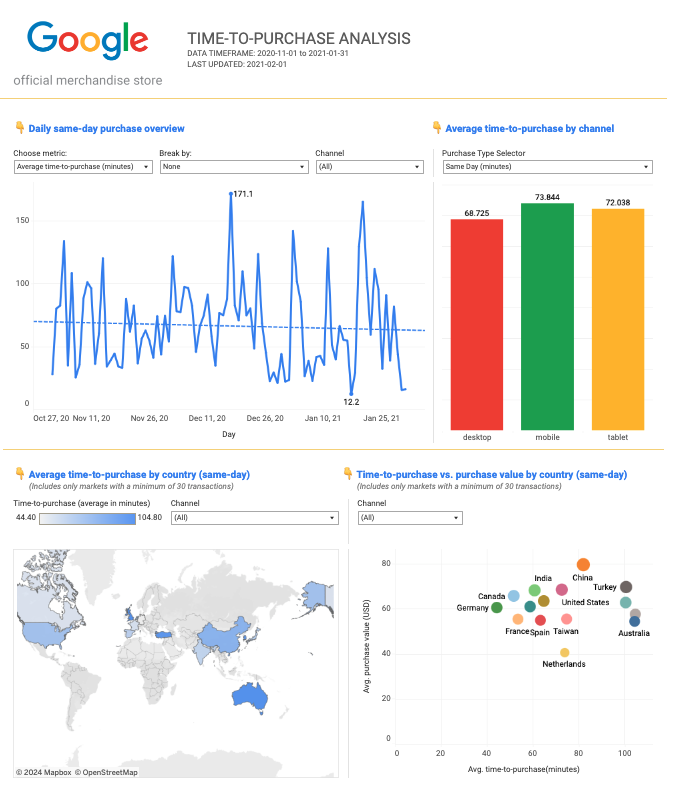

# Ecom Time-To-Purchase Analysis

## Project Objective

The objective for this project was to present an analysis, insights and presentation based on ecommerce data depicting how much time it takes for a user to make a purchase on the website. The final visualisation should show the duration dynamic on a daily basis. 

**Questions this project aimed to answer:**
1. What share of our customers do complete their purchase within the same day?
2. How long does it take for a user to make a purchase after arriving to the Google Merchandise Store on the same day?
3. How long time does it take for users to complete a purchase when not done on the same day?
4. Who are the users making a purchase the same day vs. at a later stage? Can we see any differences and draw insights from that?

## Data & Context

**Data Source:** [Turing College raw_events table](https://console.cloud.google.com/bigquery?ws=!1m5!1m4!4m3!1stc-da-1!2sturing_data_analytics!3sraw_events)

**Data Context:** This table is based on online events data from the Google Merchandise Store (https://shop.merch.google/), tracked with Google Analytics 4. 

**Data Timeframe:** 
Start: 2020-11-01 
End: 2021-01-31

**Tools used**
SQL in BigQuery, Google Sheets, Google Slides, Tableau

## Project Content

**EDA.sql** - SQL file containing the exploratory analysis and data cleaning/ preparation steps taken in BigQuery to retrieve the required data from the dataset

[**Tableau Dashboard**](https://public.tableau.com/views/ProductAnalystProject_17315029728470/Dashboard1?:language=en-US&:sid=&:redirect=auth&:display_count=n&:origin=viz_share_link) - Dashboard suporting the analysis

[**Insights Presentation**](https://docs.google.com/presentation/d/1I3pSl2BZ4dxusAr-eWbxtQKfv-cMjYekgh4bxS9eiSA/edit?usp=sharing) - Final presentation deck with insights from the analysis

## Results

Insights Presentation & Tableau Dashboard

